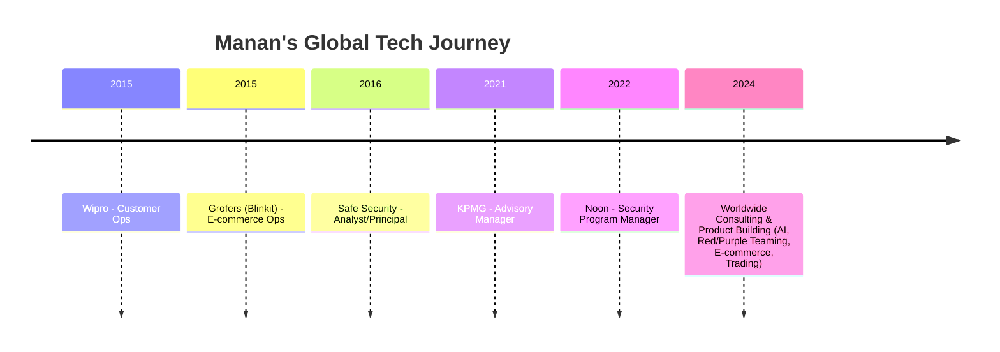

<!--
## Hi there 👋
**TheHaywire/TheHaywire** is a ✨ _special_ ✨ repository because its `README.md` (this file) appears on your GitHub profile.

Here are some ideas to get you started:

- 🔭 I’m currently working on ...
- 🌱 I’m currently learning ...
- 👯 I’m looking to collaborate on ...
- 🤔 I’m looking for help with ...
- 💬 Ask me about ...
- 📫 How to reach me: ...
- 😄 Pronouns: ...
- ⚡ Fun fact: ...
-->

# 🌍 Manan Kharbanda

**Tech & Security Leader | Builder | Explorer | AI Enthusiast**

---

## 🚀 Welcome!

Hey, I'm Manan—I've worked with unicorns, MNCs, consultancies, and startups, building and securing digital products worldwide.  
From bustling cities to remote corners, I've delivered security assessments, launched new ventures, and explored tech frontiers across continents.

---

## 🌐 Global Footprint

- 🏢 Collaborated with Fortune 500s, unicorns, and high-growth startups
- ✈️ Traveled for red teaming, purple teaming, and security assessments in 12+ countries (Middle East, Europe, SE Asia, India)
- 🤝 Helped teams scale, secure, and innovate in diverse cultures and markets

---

## 🛤️ Career Journey

---

## 🧭 What Drives Me

- Turning ideas into resilient, secure digital businesses
- Exploring new tech: AI, automation, cloud, trading
- Building and mentoring teams across borders
- Making security practical, creative, and business-focused

---

## 🏆 Quick Highlights

- Led security and product teams for e-commerce, consulting, and fintech leaders
- Delivered global red teaming, purple teaming, and advanced security programs for Fortune 500 clients
- Built and launched products across wellness, fintech, and retail
- Published thought leader in AI, security, and digital transformation

---

## 🛠️ My Tech Toolkit

### 🌐 Cloud & DevOps

### 🔒 Offensive & Defensive Security

### 🤖 AI, Automation & Data

### 🏦 Fintech & Trading

### 💡 Collaboration & Product

---

## ✨ Fun Facts

> ✈️ My security toolkit has traveled more miles than most luggage.
>
> 🥇 Helped a client launch in three countries in a single quarter.
>
> 🤖 Built bots for trading, wellness, and (accidentally) coffee orders.
>
> 🎤 Always up for a panel, podcast, or tech jam.

---

## 🌱 What I'm Exploring Now

- Next-gen AI products & secure GenAI adoption
- Automating business workflows for founders
- Algorithmic trading & digital wellness platforms

---

## 💬 Connect & Collaborate

**[LinkedIn](https://www.linkedin.com/in/manankharbanda) | [GitHub](https://github.com/TheHaywire) | [Medium](https://medium.com/@MindfulStoryteller) | [X/Twitter](https://x.com/kharbanda_manan)**

---

## 🤹‍♂️ Signature Move

> “Give me a challenge, a whiteboard, and a global team—I'll bring the coffee and the solution.”

---

<!--
This README is world-class, visually engaging, and story-driven.
No confidential project details. Optimized for recruiters, collaborators, and those who love tech, travel, and impact.
-->
